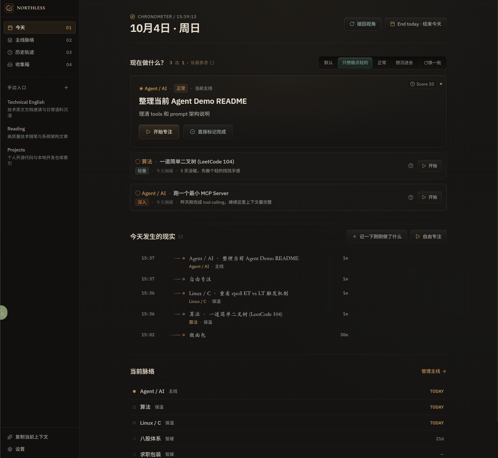
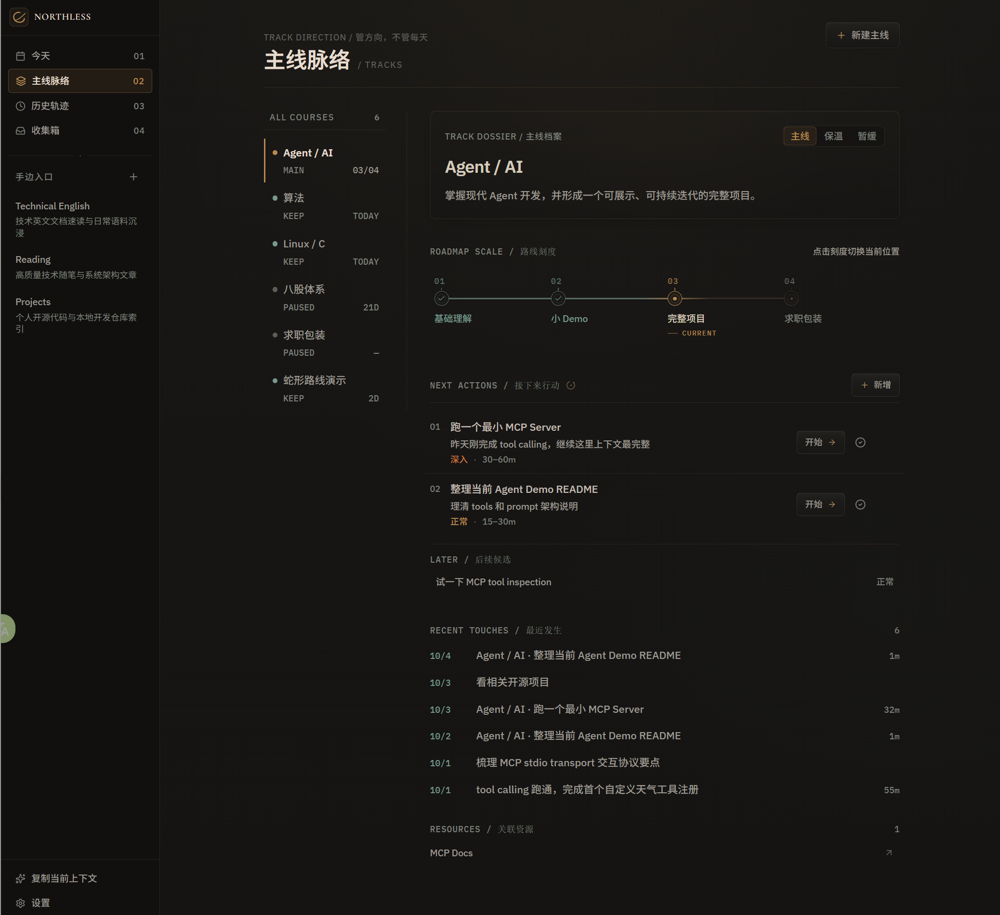
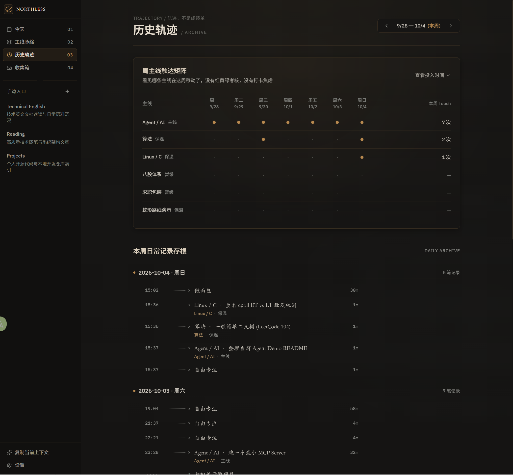
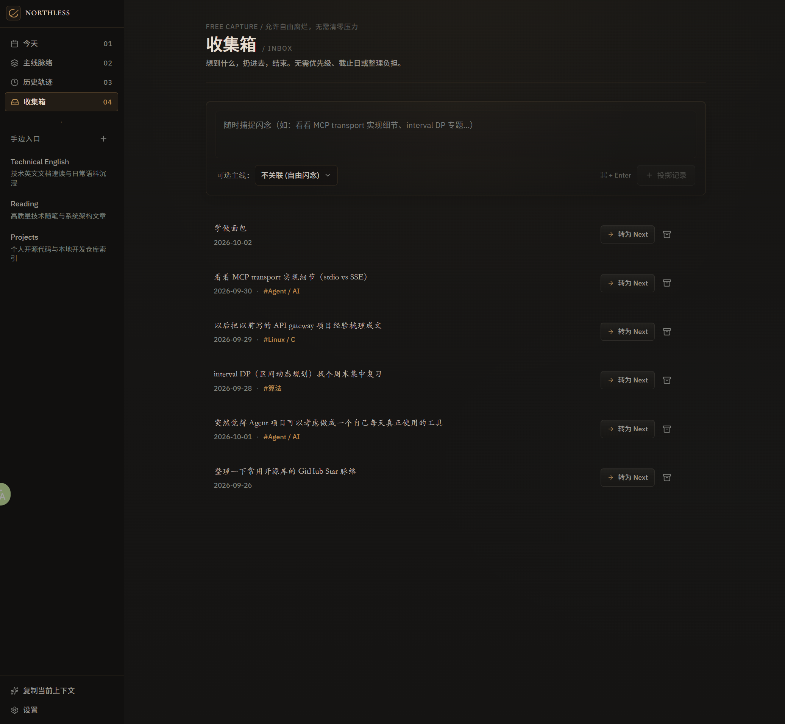

# Northless

> **No fixed north. Still moving.**

Northless 是一个为没有固定外部节奏的人设计的本地个人工作台。

它帮你留下今天，维持几条重要主线，在不知道往哪里走时找到一个有依据的下一步，也把与你此刻生活和工作有关的资源留在随手可达的地方。

## Try it

直接在浏览器中使用：

**https://fanxiaofang.github.io/northless/**

无需注册，也无需安装。

Northless 是 local-first 的：应用由 GitHub Pages 提供，但你的 Tracks、History、Inbox 等个人数据保存在当前浏览器本地，而不是 GitHub 的服务器上。

## Overview

### Today

看见今天真正发生了什么，并在需要的时候找到一个有依据的下一步。



### Tracks

维持少数真正重要的长期主线，知道自己走到了哪里，而不是把生活变成任务列表。



### History

留下走过的轨迹。它是记录，不是成绩单。



### Inbox

先把念头放下来。不是每件事都需要立刻整理、分类和行动。



## Principles

- **Local-first** — 个人数据优先留在当前设备和浏览器中
- **Low maintenance** — 使用工具本身不应该成为新的工作
- **No AI required** — 没有 AI 也应该完整可用
- **Life is recordable, not auditable** — 生活可以留下痕迹，但不必被考核

## Local data & backup

Northless 当前将个人数据保存在浏览器本地。

你可以在 **设置 → 数据备份** 中：

- 导出完整的 Northless JSON 备份
- 从已有备份恢复
- 在危险的数据操作后使用本地恢复点回退

不同设备或不同浏览器默认拥有彼此独立的数据。

如果准备更换设备、浏览器，或者清除网站数据，请先导出一份备份。

## Self-host on GitHub Pages

Northless 是一个纯前端、local-first Web App。

**不需要后端服务器，也不需要云数据库。**

你可以把它部署到自己的 GitHub Pages。

### Fork

最简单的方法是 Fork 这个仓库。

Fork 完成后进入：

**Settings → Pages → Build and deployment**

将 **Source** 设置为：

**GitHub Actions**

仓库中已经包含 GitHub Pages deployment workflow。之后每次向 `main` 推送更新，GitHub Actions 都会自动构建和部署。

地址通常是：

```text
https://<your-username>.github.io/<repository-name>/
```

例如：

```text
https://alice.github.io/northless/
```

部署脚本会根据你的仓库名称自动计算 GitHub Pages base path，因此不要求仓库必须命名为 `northless`。

### Clone to your own repository

也可以直接克隆：

```bash
git clone https://github.com/fanxiaofang/northless.git
cd northless
```

然后创建你自己的 GitHub 仓库，并修改 remote：

```bash
git remote remove origin
git remote add origin https://github.com/<your-username>/<your-repository>.git
git push -u origin main
```

之后同样进入：

**Settings → Pages → Source → GitHub Actions**

即可部署自己的 Northless。

> GitHub Pages 只负责托管应用代码。你的个人数据仍然保存在你自己的浏览器中。

## Development

安装依赖：

```bash
npm install
```

启动开发环境：

```bash
npm run dev
```

开发模式在一个全新的 workspace 中会自动注入演示数据，方便调试 Today、Tracks、History 和 Inbox。

检查类型：

```bash
npm run lint
```

正式构建：

```bash
npm run build
```

Production build 不会自动注入演示数据。

---

**Leave traces. Keep a few tracks alive. Keep moving.**